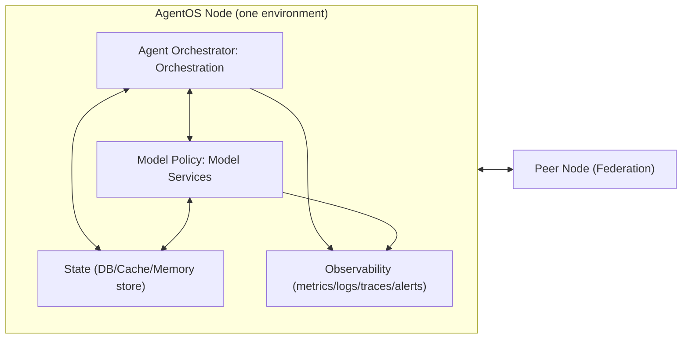

# NexixAI AgentOS v1.02 — Official Design (HLD)

This document defines the **implementation-shaping architecture** for AgentOS v1.02.
It is subordinate to the PRS and Schemas Appendix per `SPEC_AUTHORITY.md`.

## References (authoritative)
- PRS: `docs/product/agentos-prs/v1.02-prs.md`
- Schemas Appendix: `docs/product/agentos-prs/v1.02-schemas-appendix.md`

---

## 1. Scope and goals

### 1.1 In scope (v1.02)
- Two-stack per node: **Agent Orchestrator (Orchestration)** and **Model Policy (Model Services)**
- **Multi-tenancy** with tenant-scoped isolation, quotas/budgets, and tenant-safe observability
- **Federation** across nodes/environments: peer info/capabilities, run forwarding, event streaming
- Operator-grade deployment UX: `up`, `redeploy`, `validate`, `status`, `nuke`, reports, real-time progress
- Baseline observability: metrics, logs, traces, dashboards, and **SMTP email alert test**

### 1.2 Out of scope (v1.02)
- Hard multi-tenant physical isolation (separate DB per tenant) — kept as an upgrade path
- Full UI product experiences (admin UI, portals) — CLI + APIs are sufficient for v1
- Arbitrary workflow engines — v1 focuses on Runs + Events + Tool calls + Model calls

---

## 2. System overview

Each **AgentOS Node** is a deployable unit containing Agent Orchestrator and Model Policy (and supporting infra).
Nodes can federate with other nodes.

### 2.1 External surfaces
- **Product-facing API** (Agent Orchestrator): Runs + Events streaming
- **Model API** (Model Policy): model invoke + policy + models list
- **Federation API** (Agent Orchestrator): peer info/capabilities + forward run + stream events

---

## 3. Internal module boundaries (ports/adapters)

**Non-negotiable:** internal modules call each other only through **ports** (interfaces).
Adapters implement ports and are swappable with conformance tests.

### 3.1 Agent Orchestrator (Orchestration Stack) modules
- `api`: HTTP handlers, auth parsing, request validation
- `runtime`: run scheduler/executor, step engine, timeouts/retries
- `events`: event emission + SSE fan-out
- `ports`:
  - `ModelPort` (to Model Policy)
  - `ToolPort` (invoke tools)
  - `MemoryPort` (KV + search)
  - `RunStatePort` (persist run graph/state)
  - `QueuePort` (enqueue/dequeue/concurrency limits)
  - `EventSinkPort` (optional durable event sink)
- `federation`: peer client/server, forwarder, capabilities negotiation
- `tenancy`: tenant context + quota enforcement (Agent Orchestrator)

### 3.2 Model Policy (Model Services Stack) modules
- `api`: HTTP handlers (OpenAI-compat style)
- `router`: resolve `model_ref` to provider backend + fallback chain
- `policy`: allow/deny/redact checks
- `metering`: usage accounting (tokens/cost), attribution to tenant/principal/run
- `budgets`: enforce per-tenant budgets/quotas
- `providers`: adapters (ollama, vllm, openai, etc.)

### 3.3 Auth Context propagation (required)
All internal calls carry the **Auth Context** object (Appendix B), minimally:
- `tenant_id`
- principal identity
- scopes/roles
- policy_context

---

## 4. Persistence and data model

### 4.1 Storage principles
- **Tenant-scoped keys/tables/namespaces** are mandatory.
- Runs and Events are immutable append-heavy records.
- Idempotency is enforced at run creation.

### 4.2 Canonical storage keying (normative guidance)
Matches Schemas Appendix “Run/Event Storage Keys”:
- `tenant/{tenant_id}/runs/{run_id}`
- `tenant/{tenant_id}/runs/{run_id}/events/{sequence}`
- `tenant/{tenant_id}/agents/{agent_id}`
- `tenant/{tenant_id}/usage/{window}/{date}`

### 4.3 Run state model
- Run state is a small state machine: `queued -> running -> completed|failed|canceled`
- Step state is tracked per run to support replay/debug and reporting.

### 4.4 Event model
- Events are **at-least-once** delivered.
- Ordering within a run is defined by `(sequence)`; dedupe by `event_id`.
- SSE stream is tenant-scoped and requires auth.

---

## 5. Multi-tenancy design

### 5.1 Isolation level (v1.02 default)
Logical isolation (tenant partitions in shared backing stores), upgradeable later.

### 5.2 Enforcement points
- **Ingress (HTTP):** derive tenant via auth; reject missing/invalid tenant
- **Run creation:** enforce per-tenant QPS, burst, concurrency caps
- **Tool invocation:** enforce per-tenant tool allowlist and tool call rate limits
- **Memory access:** namespace all reads/writes by tenant
- **Model invocation (Model Policy):** enforce entitlements + budget + max tokens

### 5.3 Quotas and budgets
Implement in two layers:
- **Hard gating** at request time (fast check)
- **Usage ledger** for accurate accounting (eventual consistency acceptable, but never “free unlimited”)

---

## 6. Agent Orchestrator ⇄ Model Policy interaction

### 6.1 Model calls
Agent Orchestrator calls Model Policy through `ModelPort` with:
- `auth` context
- `request_id` for dedupe/audit
- `model_ref` and requirements
- input messages/tools
Model Policy returns:
- output + usage + route + policy outcome + correlation_id

### 6.2 Policy checks
Model Policy may expose `policy/check`. Agent Orchestrator may call it explicitly, but Model Policy must also enforce policy during model calls.

---

## 7. Federation design

### 7.1 Trust model (v1.02)
- **mTLS** between peers recommended.
- Requests carry signed/verifiable tenant + principal identity (JWT recommended).
- Receiving peer must treat tenant context as authoritative and enforce locally.

### 7.2 Capabilities negotiation
- `GET /v1/peer/capabilities` is used to determine:
  - supported features
  - limits
  - model tiers/backends
  - required fields/version compatibility

### 7.3 Run forwarding
- `POST /v1/federation/runs:forward` forwards a run request and returns:
  - remote `run_id` and remote `events_url`
- Forwarder must propagate `tenant_id` + principal identity + traceparent.

### 7.4 Event streaming across federation
- Preferred: caller streams events directly from remote `events_url`
- Optional: event replication via `events:ingest` for caching/aggregation
- Semantics: at-least-once, dedupe by `event_id`, ordered by `sequence`

---

## 8. Deployment topology and UX

### 8.1 One-command operator model
CLI (`agentos`) runs phases:
1) preflight
2) boot
3) seed
4) wire
5) validate
6) report

### 8.2 Seeding requirements
- demo/dev: create default tenant + tenant admin + sample agent/tool
- prod: guided bootstrap is allowed but must still end with a report

### 8.3 Reports
Every command emits:
- `reports/<action>-TIMESTAMP.md`
- `reports/<action>-TIMESTAMP.json`

Minimum report content:
- endpoints/ports
- seeded IDs (tenant, admin, sample agent/tool)
- health checks + smoke tests
- alert delivery test status

---

## 9. Observability and alerting

### 9.1 Required signals
- Metrics (Prometheus style)
- Structured logs with `tenant_id`, `run_id`, `correlation_id`, `trace_id`
- Traces (OTel) with span attributes including tenant/run

### 9.2 Cardinality safety
- Avoid unbounded `tenant_id` cardinality in global metrics.
- Provide:
  - aggregated metrics (global)
  - per-tenant views via filtering/pre-aggregation (dashboards)

### 9.3 Alerts (baseline)
- service down
- high error rate
- p95 latency high
- backend unreachable
- queue depth high
- disk full
- tenant budget exceeded (optional but recommended)

SMTP email alerting is required OOTB, and `agentos validate` must include a “test alert” option.

---

## 10. Failure modes and resilience

### 10.1 Dependency failures
- If Model Policy is unavailable:
  - Agent Orchestrator run should fail with `dependency_unavailable` unless configured for retry/backoff.
- Tool timeouts:
  - emit tool requested + completed with error
  - proceed according to agent policy (retry/abort)

### 10.2 Backpressure
- Queue depth metrics + concurrency caps are enforced per tenant and globally.
- Rate limiting must return consistent `rate_limited` errors.

### 10.3 Idempotency
- `POST /runs` must support idempotency keys:
  - same key + same tenant/principal/agent returns existing run record.

---

## 11. Implementation sequencing (from plan)

1) Populate OpenAPI stubs from Schemas Appendix
2) Populate examples from Schemas Appendix
3) Add conformance tests (examples validate, additive-only guards)
4) Scaffold Go services + CLI
5) Implement Agent Orchestrator run/event loop + Model Policy routing/policy + federation forward/events
